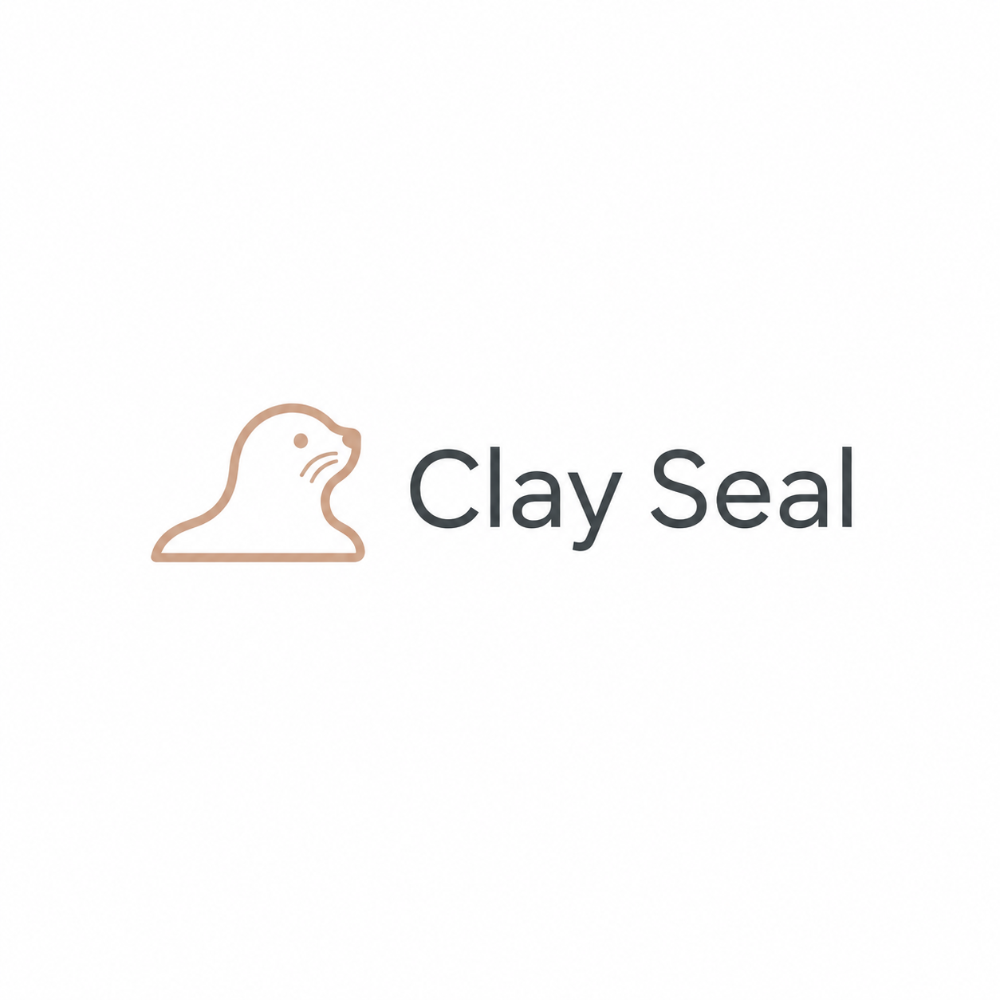

# Clay Seal Receipts



Verifiable receipts for AI agent actions.

Clay Seal Receipts wraps an agent or tool call and records what was requested,
what policy was checked, which identity or capability context was bound to the
decision, and what happened. The result is a receipt that another service,
partner, or auditor can verify later without trusting your application logs.

The Python package is still named `agentauth-receipts` and imports from
`agentauth.receipts` for compatibility.

## Install

```bash
pip install "agentauth-receipts[server,verifier]"
```

For local development from this repo:

```bash
# Use Python 3.11-3.13 for the full dev stack.
python -m venv .venv
source .venv/bin/activate

# Install sibling layers first when working from local checkouts.
pip install -e "../clay-seal-core[dev]"
pip install -e "../clayseal-identity[dev]"
pip install -e "../clay-seal-capabilities[dev]"
pip install -e ".[dev]"
pytest python/tests -q
```

Receipts has one required Clay Seal dependency: `agentauth-core`. Native Clay
Seal identity and capability binding are optional extras:

```bash
pip install "agentauth-receipts[identity]"   # Clay Seal identity sessions
pip install "agentauth-receipts[scoping]"    # Clay Seal capability leases
pip install "agentauth-receipts[frameworks]" # common agent framework adapters
pip install "agentauth-receipts[mcp]"        # MCP examples and gateway pieces
```

## Quickstart

```python
from agentauth.receipts import AgentWrapper, Policy

policy = Policy.from_yaml("policies/fraud_decision.yaml")
wrapper = AgentWrapper(model=my_model, policy=policy, mode="shadow")

result = wrapper.run({"transaction_id": "tx-1", "amount": 50000})
report = result.proof.verify()
assert report.valid
```

`shadow` mode records receipts without blocking actions. Move selected
workflows to `bounded_auto` only after you have reviewed receipts from real
traffic.

## Identity Binding

Receipts can bind to Clay Seal Identity or to claims from providers you already
verify, including OIDC, SPIFFE JWT, Auth0, AWS STS, Azure AD, Entra, and GCP.

```python
from agentauth.receipts.identity_providers import get_identity_provider
from agentauth.receipts.integration import wrap_with_identity_session

session = get_identity_provider("oidc").build_session(
    verified_claims,
    evidence_verified=True,
)

wrapper = wrap_with_identity_session(
    model=my_model,
    policy=policy,
    session=session,
    mode="shadow",
)
```

Provider adapters map already-verified identity claims into receipt authority
bindings. They do not replace JWT verification, PoP checks, token revocation, or
your normal gateway policy.

## What This Is

Clay Seal Receipts is an audit and verification layer. It helps you prove what
an agent was allowed to do and what it actually did.

It is not a full sandbox by itself. For production agent systems, use receipts
with short-lived identity, online checks for sensitive actions, scoped
capabilities, signed bundles, and retention rules for prompt/tool data.

## Docs

- [Developer guide](docs/DEV_GUIDE.md)
- [Deployment guide](docs/deployment.md)
- [Trust model](docs/trust_model.md)
- [Framework integrations](docs/framework_integrations.md)
- [HTTP verifier](docs/http_verifier.md)
- [Privacy and data handling](docs/PRIVACY.md)
- [Security policy](SECURITY.md)
