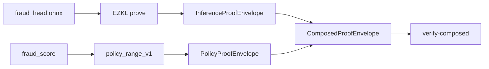

# Inference proofs (EZKL) and composition

Milestone 3 attests **model inference** with EZKL and **policy conformance** with Halo2, then verifies both in one `ComposedProofEnvelope`.

## Architecture



This is **logical composition**: the verifier checks both sub-proofs plus explicit hash bindings. A single recursive SNARK over EZKL+Halo2 is future work.

## Setup

```bash
pip install torch onnx   # export ONNX
# install ezkl CLI — see https://docs.ezkl.xyz
./scripts/ezkl_setup_fraud_head.sh
CARGO_TARGET_DIR=$PWD/target cargo build -p agent-receipts-cli --release
```

## CLI

```bash
# Inference only (stub if EZKL artifacts missing)
./target/release/agent-receipts prove-inference \
  --amount 2500 --model-provenance-hash sha256:fraud-head-onnx-v1 \
  --output-hash abc --out /tmp/inf.json --allow-stub

# Composed one-shot
./target/release/agent-receipts prove-composed \
  --amount 2500 --fraud-score 0.25 \
  --policy-commitment <hash> --model-provenance-hash sha256:fraud-head-onnx-v1 \
  --output-hash abc --context-hash ctx --out /tmp/composed.json --allow-stub

./target/release/agent-receipts verify-composed --envelope /tmp/composed.json --allow-stub
```

## Python

```python
agent = AgentWrapper(
    model=...,
    policy=policy,
    mode="prove",
    prove_composed=True,
    model_provenance_hash="sha256:fraud-head-onnx-v1",
)
result = agent.run({"amount": 2500.0})
result.proof.verify()  # verifies composed envelope when present
```

```bash
python3 examples/composed_prove_fraud_agent.py
```

## Bindings checked

| Binding | Meaning |
|---------|---------|
| `output_hash` | Same on policy, inference, and composed |
| `policy_commitment` | Matches committed YAML policy |
| `model_provenance_hash` | Matches certificate / inference envelope |
| `public_score` | Aligns inference float score with policy scaled public input |

## Stub mode

When `circuits/fraud_head/ezkl/` is not set up, `--allow-stub` produces `attestation: stub` for development. Production verification must use real EZKL or RISC Zero proofs.

Python helpers default stubs **off** for both proving and verification. Set
`AGENT_RECEIPTS_ALLOW_STUB=1` only for local demos. `prove` mode and proof-enabled
`bounded_auto` mode raise an error when a requested prover returns no proof, so a
missing CLI no longer silently degrades a receipt into an unproven `full_zk` claim.
If a stub envelope is explicitly generated, the wrapper does not label the receipt as
`full_zk`.

## Non-EZKL inference: RISC Zero zkVM (SOTA-8)

EZKL compiles the ONNX head into a Halo2 circuit with a **per-model** proving/verifying key.
SOTA-8 adds a second backend that proves the *same* head via a universal zkVM with **no
per-model trusted setup**. The canonical rule
`fraud_head_score(amount) = clamp(amount / 10_000, 0, 1)` lives in
[`inference.rs`](../crates/agent-receipts-composed/src/inference.rs); every backend attests to it.

| Backend | `attestation` | Setup | Verifier anchor |
|---------|---------------|-------|-----------------|
| EZKL (Halo2) | `ezkl` | per-model key + SRS | `vk.key` + `settings.json` |
| RISC Zero zkVM | `risc0` | **none** (universal) | guest `image_id` |
| SP1 / Plonky3 zkVM | `sp1` | **none** (universal) | program vk hash (`image_id`) |
| Stub | `stub` | none | dev only — rejected in prod |

The zkVM guest ([`crates/agent-receipts-zkvm/methods/guest`](../crates/agent-receipts-zkvm/methods/guest/src/main.rs))
runs the head inside the zkVM and commits the score to the journal; the receipt proves *this
program* produced *this score*. `InferenceProofEnvelope` gains an `image_id` field and a `risc0`
attestation; `verify_inference_envelope` re-runs the zkVM verifier.

The `agent-receipts-zkvm` crate is **detached from the workspace** (its own `[workspace]`), so the
rest of agent-receipts builds and tests without the zkVM toolchain. The composed crate invokes it
by shelling out (`AGENT_RECEIPTS_ZKVM_BIN`, default `agent-receipts-zkvm`), exactly as it already
does for `ezkl`.

```bash
# one-time: https://risczero.com/install && rzup install
scripts/zkvm_prove_fraud_head.sh 25000
```

## SP1 / Plonky3 zkVM (SOTA-12)

SOTA-12 adds a third zkVM backend on **SP1** (Succinct, Plonky3). The guest commits the same
journal as RISC Zero — `(amount, output_hash, model_provenance_hash, score)` — so both backends
attest to identical semantics. The composed crate shells out to `agent-receipts-sp1`
(`AGENT_RECEIPTS_SP1_BIN`, default `agent-receipts-sp1`), mirroring the RISC Zero integration.

```bash
# one-time: https://sp1up.succinct.xyz — pin CLI to match sp1-sdk 5.2.4
scripts/sp1_build_fraud_head.sh
scripts/sp1_benchmark_fraud_head.sh 25000

# inference envelope via main CLI
./target/release/agent-receipts prove-inference \
  --amount 25000 --model-provenance-hash sha256:fraud-head-onnx-v1 \
  --output-hash abc --backend sp1 --out /tmp/inf-sp1.json
```

The SP1 crate is **detached from the workspace** (like RISC Zero). Pin `cargo-prove` and
`sp1-sdk` to the same release — a bleeding-edge CLI emits riscv64im ELFs that panic against
crates.io `sp1-sdk` 5.2.4 (`must be a 32-bit elf`). See [sp1_benchmark.md](sp1_benchmark.md).

### Cost comparison (fraud head)

RISC Zero figures are **measured locally** (Apple Silicon, RISC Zero 3.0.5) by the script above.
EZKL figures are **cited** from published `ezkl` benchmarks for a comparable single-gate head (no
`ezkl` binary in this environment) and are labeled as such — not measured here.

<!-- MEASURED:RISC0 -->
**Measured** (Apple Silicon, RISC Zero 3.0.5, default prover — real STARK, not dev-mode):

| Input `amount` | Committed score | Prove time | Receipt size | `image_id` |
|----------------|-----------------|-----------|--------------|------------|
| 2500 | 0.25 | 6.31 s | 209,578 B | `0d778269…283c658e` |
| 25000 | 1.0 (clamped) | 7.24 s | 209,578 B | `0d778269…283c658e` |

The `image_id` is identical across inputs — one program identity, no per-input or per-model
ceremony. Receipt size is input-independent. Verification accepts the committed score and rejects
a tampered one (`scripts/zkvm_prove_fraud_head.sh` asserts both).
<!-- /MEASURED:RISC0 -->

| Dimension | EZKL (Halo2) | RISC Zero zkVM |
|-----------|--------------|----------------|
| Per-model setup | required (keygen + SRS) | **none** |
| Proof artifact | proof + vk + settings + SRS | self-contained receipt |
| Verifier inputs | vk + settings + SRS | `image_id` only |
| Maintainability | recompile + keygen per model change | rebuild guest; `image_id` rotates |
| Proving cost (tiny head) | low (small circuit) | higher (fixed zkVM overhead) |

The trade-off: EZKL pays a one-time per-model setup for a cheap small-circuit proof; the zkVM
pays a per-proof overhead but removes per-model ceremony and shrinks the verifier's trusted inputs
to a single `image_id`. For a head this small EZKL is cheaper per proof; the zkVM wins on
maintainability and the cross-over favors it as program complexity grows.

## Decision record: ZK vs TEE vs opML by model size

**Context.** ZK-proving a full transformer is infeasible today; no single mechanism covers every
model size. Route by size/structure.

| Model class | Mechanism | Rationale |
|-------------|-----------|-----------|
| Small heads / classifiers / guards (e.g. fraud head) | **ZK** — RISC Zero or SP1 zkVM (default) or EZKL | Cheap enough to prove fully; strongest guarantee; zkVM removes per-model setup |
| Mid-size models (mid open-weights, embeddings) | **opML** — optimistic execution + ZK dispute | Full ZK too costly; optimistic-by-default with a fraud-proof fallback stays economical |
| LLM-scale (frontier / hosted) | **TEE attestation** (SOTA-2, RATS/EAT) | Cannot ZK-prove at scale; a hardware-attested enclave gives honest "ran on model M" provenance |

This maps onto the assurance taxonomy (SOTA-3): `zk_execution_proved` for the ZK leg,
`tee_attested` for the TEE leg, with opML between as an optimistic claim that escalates to a ZK
dispute. The `tee_*` tiers (SOTA-2) are the pragmatic unlock for LLM-scale and are independent of
the ZK work here.

**Why not one mechanism:** all-ZK is impossible at LLM scale; all-TEE accepts a weaker trust root
where ZK is feasible; all-opML leaves an unnecessary dispute window for cheap heads. The envelope
carries the backend (`attestation`) so a verifier thresholds on it — routing by size is a policy
decision, not a protocol change. Recursive composition of the inference and policy legs into one
proof is tracked separately (SOTA-10).
