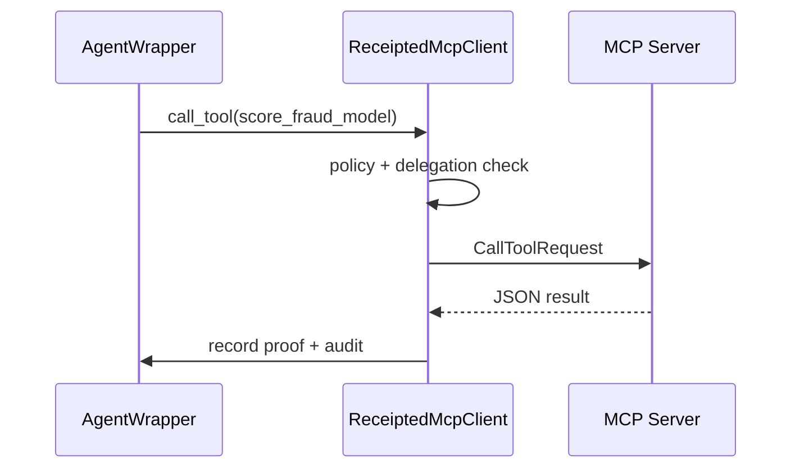

# Live MCP server pilot

stdio, SSE, and streamable HTTP transports for the fraud MCP server, plus `ReceiptedMcpClient` for tool RPCs with audit receipts (and optional ZK in `prove` mode).

## Architecture



Policy enforcement runs **on the client** before the RPC. The MCP server exposes tools only; it does not write audit records.

## Install

```bash
pip install -e ".[mcp,dev]"
```

## Run server

### stdio (IDE / subprocess)

```bash
agent-receipts-mcp-server
# or
python3 examples/mcp_live_server.py
```

### SSE (remote pilot)

```bash
python3 examples/mcp_live_server.py --transport sse --host 127.0.0.1 --port 8000
# Client URL: http://127.0.0.1:8000/sse
```

### Streamable HTTP

```bash
python3 examples/mcp_live_server.py --transport streamable-http --port 8000
# Client URL: http://127.0.0.1:8000/mcp
```

Environment overrides: `AGENT_RECEIPTS_MCP_TRANSPORT`, `AGENT_RECEIPTS_MCP_HOST`, `AGENT_RECEIPTS_MCP_PORT`.

### HTTP authentication (reference server)

This MCP server is a **local pilot**, not a production service. For SSE and streamable HTTP:

- Set `AGENT_RECEIPTS_MCP_API_KEY` to require `X-API-Key` (or `Authorization: Bearer`) on every HTTP request.
- Binding to a non-localhost host (for example `0.0.0.0`) **without** that env var exits immediately.
- `ReceiptedMcpClient` / `McpConnectionSpec` forward the same env var automatically on remote transports.

```bash
export AGENT_RECEIPTS_MCP_API_KEY='dev-only-secret'
python3 examples/mcp_live_server.py --transport sse --host 127.0.0.1 --port 8000
```

## Run clients

```bash
# stdio pilot (spawns server subprocess)
python3 examples/mcp_live_client.py

# prove + composed ZK on live MCP (requires built CLI)
python3 examples/mcp_live_prove_client.py
python3 examples/mcp_live_prove_client.py stdio

# SSE (start server in another terminal first)
python3 examples/mcp_live_server.py --transport sse --port 8000
python3 examples/mcp_sse_client.py 8000
```

## Tools exposed

| Tool | Returns |
|------|---------|
| `score_fraud_model` | `{decision, fraud_score, transaction_id}` — policy-checkable |
| `score_transaction` | `{transaction_id, scored}` |
| `fetch_customer_profile` | `{customer_id, tier}` |

## Python API

```python
import asyncio
from agentauth.receipts import AgentWrapper, Policy, ReceiptedMcpClient, connect_mcp, default_sse_spec

async def run():
    policy = Policy.from_yaml("policies/fraud_decision.yaml")
    agent = AgentWrapper(
        model=lambda inp: {"decision": "approve", "fraud_score": 0.0},
        policy=policy,
        mode="prove",
        prove_composed=True,
    )
    spec = default_sse_spec(port=8000)
    async with connect_mcp(spec) as session:
        client = ReceiptedMcpClient(agent, session, transport=spec.transport)
        result = await client.call_tool(
            "score_fraud_model",
            {"transaction_id": "tx-1", "amount": 2500.0},
        )
        print(result.proof.proof_id, result.proof.verify())

asyncio.run(run())
```

## Compose with ZK on live MCP

Set `mode="prove"` and `prove_composed=True` on `AgentWrapper`. For `score_fraud_model`, the client unwraps `output["result"]` for policy checks and uses `context["input"]["amount"]` plus `fraud_score` for composed EZKL + Halo2 proofs.

```bash
CARGO_TARGET_DIR=$PWD/target cargo build -p clay-seal-receipts-cli --release
python3 examples/mcp_live_prove_client.py
```

## Cursor / Claude Desktop

Generate project-local MCP config:

```bash
python3 scripts/gen_cursor_mcp.py
# writes .cursor/mcp.json
```

Or copy [config/cursor-mcp.json.example](../config/cursor-mcp.json.example) and replace `REPLACE_WITH_REPO_ROOT` with the absolute path to this repository.

```json
{
  "mcpServers": {
    "clay-seal-receipts-fraud": {
      "command": "python3",
      "args": ["/absolute/path/to/clay-seal-receipts/examples/mcp_live_server.py"]
    }
  }
}
```

Wrap agent code with `ReceiptedMcpClient` when using the Python SDK; the IDE alone will not add receipts without the client wrapper.
