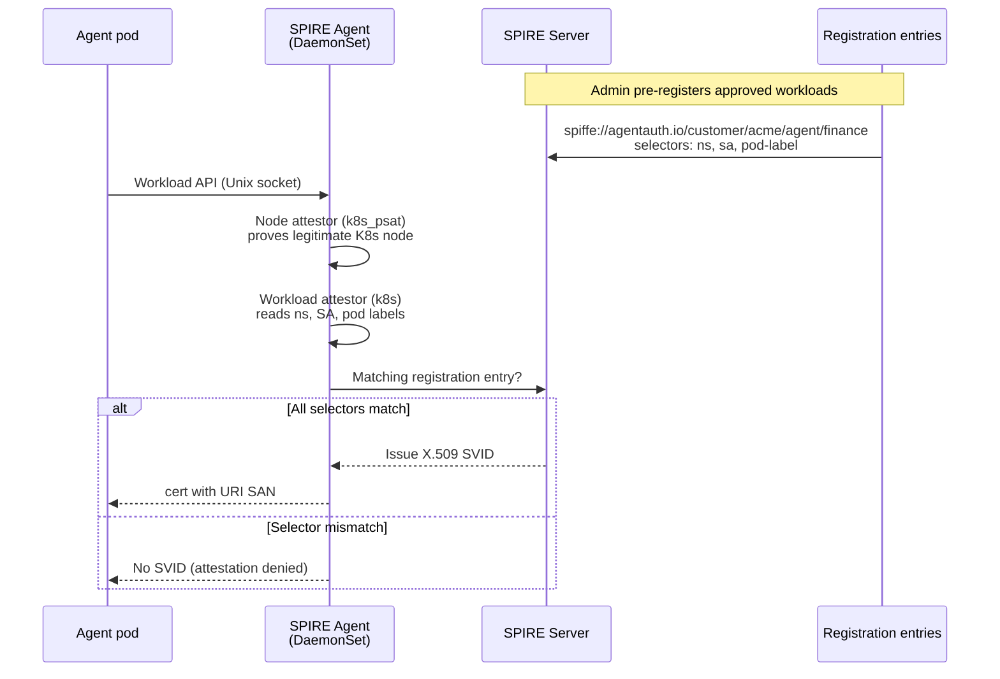

# Production identity prototype (Kubernetes + SPIRE)

This directory shows how [identity.md](./identity.md) maps onto a real Kubernetes deployment. The dev Identity Service (`../agentauth/backend/identity.py`) mints JWT-SVIDs after API-key auth; in production that role is played by **SPIRE**, which issues **X.509 SVIDs** after cryptographic **node + workload attestation**.

## Mental model



## JWT today vs SVID in production

| Dev JWT (`issue_credential`) | Production SPIRE |
|------------------------------|------------------|
| `aud` / `customer_id` | SPIFFE path `/customer/{id}` |
| `agent_type` | SPIFFE path `/agent/{type}` |
| `sub` (agent id) | Short-lived cert + optional separate agent id claim |
| `scope`, `owner`, delegation | Policy layer on SPIFFE ID (OPA, Cedar, etc.) |
| API key proves tenant | Node + workload attestors prove environment |
| EdDSA (Ed25519) + per-customer JWKS | X.509 SVID signed by SPIRE CA |

Example production SPIFFE ID (from `identity.md`):

```text
spiffe://agentauth.io/customer/acme/agent/finance
```

## What gets deployed

| Component | Purpose |
|-----------|---------|
| `k8s/spire/` | SPIRE Server (StatefulSet) + Agent (DaemonSet), trust domain `agentauth.io` |
| `k8s/agents/` | Three demo workloads in `customer-acme` namespace |
| `scripts/install.sh` | Apply manifests, register entries, wait for pods |
| `scripts/demo.sh` | Show approved vs denied attestation |

### Demo workloads

1. **finance-agent** — namespace `customer-acme`, SA `finance-agent`, label `agentauth.io/agent-type=finance` → receives finance SVID.
2. **research-agent** — SA `research-agent`, label `agentauth.io/agent-type=research` → receives research SVID.
3. **rogue-agent** — uses `finance-agent` SA but label `agentauth.io/agent-type=impostor` → **no SVID** (proves attestation beats stolen credentials).

Registration entries (created by `scripts/register-entries.sh`) require **all** selectors:

```bash
k8s:ns:customer-acme
k8s:sa:finance-agent
k8s:pod-label:agentauth.io/agent-type:finance
```

That is the production equivalent of “this agent type is only allowed in pre-approved environments.”

## Prerequisites

- Docker Desktop (or another container runtime for kind)
- `kubectl` and `kind` — `brew install kubectl kind`

## Quick start

```bash
# From repo root — creates a SPIRE-compatible kind cluster, then deploys
bash identity/scripts/setup-cluster.sh
bash identity/scripts/install.sh
bash identity/scripts/demo.sh
```

If `install.sh` reports `Missing required command: kubectl`, install the CLI tools first:

```bash
brew install kubectl kind
```

Override cluster name if node attestation fails (SPIRE `k8s_psat` must match kubeconfig):

```bash
AGENTAUTH_CLUSTER_NAME=kind-kind bash identity/scripts/install.sh
```

## Teardown

```bash
bash identity/scripts/teardown.sh
```

## Attestation details (SPIRE)

**Node attestors** (`k8s_psat` in `k8s/spire/server-configmap.yaml`):

- SPIRE Agent presents its projected service account token.
- SPIRE Server validates via Kubernetes TokenReview API.
- Node receives SPIFFE ID `spiffe://agentauth.io/ns/spire/sa/spire-agent`.

**Workload attestors** (`k8s` plugin in `k8s/spire/agent-configmap.yaml`):

- On each Workload API call, the agent inspects the calling process and queries the kubelet.
- Selectors like `k8s:ns`, `k8s:sa`, `k8s:pod-label` are matched against registration entries.

In cloud production you would additionally enable cloud node attestors (AWS IID, GCP metadata) and stricter image or UID selectors — the pattern is the same.

## Files

```text
identity/
  identity.md              # Production identity design note
  README.md                # This file
  k8s/                     # SPIRE + agent manifests (kustomize)
  scripts/                 # install, register, demo, teardown
  workloads/agent/         # Optional Dockerfile + fetch-svid helper
```

## Related code

- JWT issuance: `../agentauth/backend/identity.py` — `issue_credential()`, `validate_token()`
- HTTP API: `../agentauth/backend/routers/identity.py` — `POST /v1/identify`

The SDK’s `agentauth.identify()` stays the developer-facing API; hosted production would exchange attestation for an SVID (or a JWT-SVID derived from it) behind that same call.
